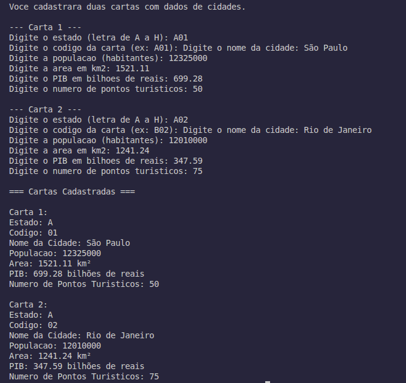

# Super Trunfo de Países

Projeto do jogo **Super Trunfo de Países**, desenvolvido em C. Neste primeiro nível, o programa permite cadastrar e exibir os dados de duas cartas com informações sobre cidades.

## Sobre o projeto

Cada carta representa uma cidade e contém os seguintes atributos:

| Campo | Tipo | Descrição |
|-------|------|-----------|
| Estado | `char` | Letra de **A** a **H** |
| Código da Carta | `char[]` | Estado + número de 01 a 04 (ex.: `A01`, `B03`) |
| Nome da Cidade | `char[]` | Nome da cidade |
| População | `int` | Número de habitantes |
| Área | `float` | Área em km² |
| PIB | `float` | Produto Interno Bruto em bilhões de reais |
| Pontos Turísticos | `int` | Quantidade de pontos turísticos |

O programa lê os dados pelo teclado, armazena em variáveis e exibe as duas cartas de forma organizada na tela.

## Requisitos

- Compilador **GCC** (ou compatível com C11)
- Terminal para entrada e saída de dados

## Como executar

### 1. Compilar

```bash
gcc -Wall -Wextra -std=c11 -o super_trufo main.c
```

### 2. Executar

```bash
./super_trufo
```

O programa solicitará os dados de cada carta. Informe os valores e pressione **Enter** após cada campo.

### Exemplo de entrada

**Carta 1**

```
Estado: A
Código: A01
Cidade: São Paulo
População: 12325000
Área: 1521.11
PIB: 699.28
Pontos turísticos: 50
```

**Carta 2**

```
Estado: B
Código: B02
Cidade: Rio de Janeiro
População: 6748000
Área: 1200.25
PIB: 300.50
Pontos turísticos: 30
```

## Estrutura do projeto

```
super-trufo-cards/
├── main.c          # Código-fonte principal
├── super_trufo     # Executável (gerado após compilar)
├── assets/         # Imagens e capturas de tela
└── README.md
```

## Demonstração

Salve o print do terminal em `assets/terminal.png` (ou ajuste o caminho abaixo) e descomente a linha da imagem.



## Nível atual

Este é o **Nível 1** do desafio. O foco está em:

- Leitura de dados do usuário (`scanf`)
- Armazenamento em variáveis
- Exibição formatada na tela (`printf`)

Não há comparação entre cartas, estruturas de repetição (`for`, `while`) nem condicionais (`if`, `else`) nesta versão.

## Próximos passos

Nos níveis seguintes, o jogo evoluirá com novas funcionalidades, como comparação de atributos entre cartas e lógica de disputa do Super Trunfo.
